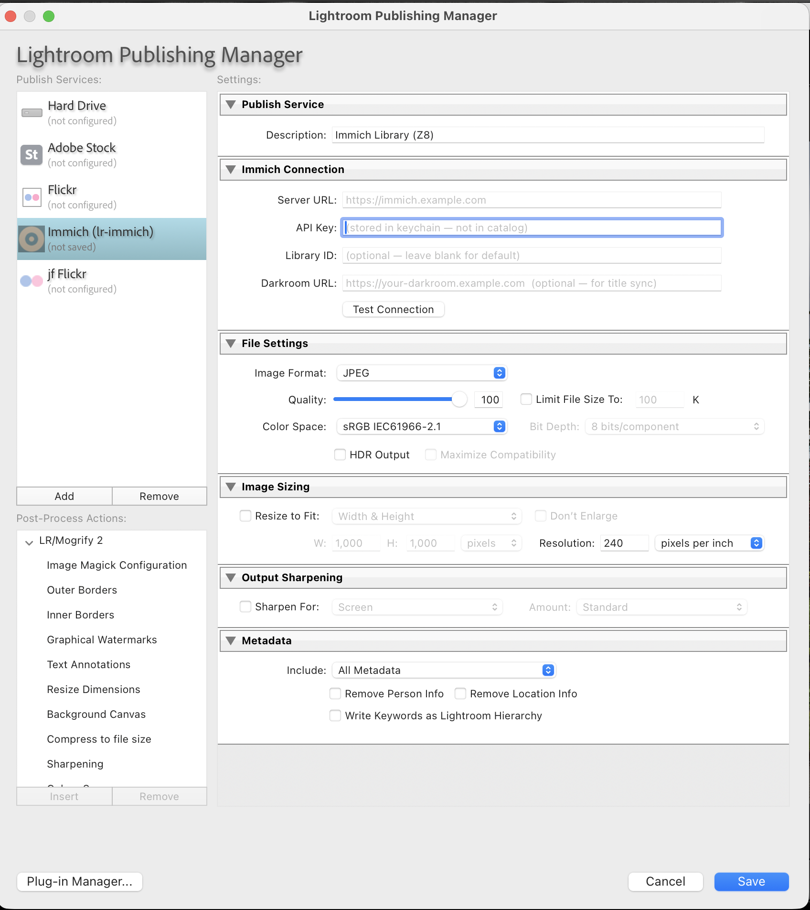
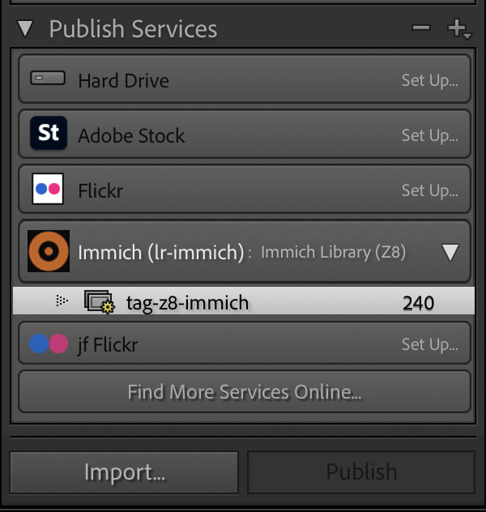

# lr-immich

A Lightroom Classic publish service that sends photos directly to
[Immich](https://immich.app), with the metadata-republish behavior
Adobe's built-in "Hard Drive" provider was supposed to have.

## The problem this solves

Adobe's built-in publish providers hard-code their republish triggers
inside Lightroom Classic. Color label changes, develop edits, ratings,
even XMP refreshes flag every affected photo for republish — and the
`metadataThatTriggersRepublish` setting LR exposes for 3rd-party
providers is **ignored for the built-ins**.

In practice: if you've been using LR's Hard Drive publish to push JPEGs
into an Immich watch folder, applying a color label to 3,000 photos
floods your publish queue with 3,000 photos asking to be re-rendered
and re-uploaded. Hours of needless work. Trashed shadows accumulating
in Immich.

This plugin is a 3rd-party publish provider that **declares its own
narrow trigger set**: only keyword, caption, title, GPS, and dateCreated
changes flag a photo for republish. Color labels, ratings, develop
edits, XMP refreshes — ignored.

## What it does

- **Direct upload to Immich** via the REST API. No intermediate watch
  folder, no sidecar daemon, no SMB share. The plugin calls
  `POST /api/assets` (new) and `PUT /api/assets/{id}/original` (replace)
  via curl shell-outs.
- **Metadata-only fast path.** Caption/GPS/dateCreated changes go through
  `PUT /api/assets/{id}` as a ~500ms JSON PATCH — no JPEG render, no
  re-upload, no trashed shadow on Immich.
- **Keyword → Immich tag sync** (full mirror). Adds, removes, and creates
  Immich tags from your LR keyword list. LR is the source of truth.
- **Custom Library menu item**: *Library → Plug-in Extras → Push Selected
  to Immich.* Push metadata changes for a hand-picked set of photos
  without batch-publishing whatever else is queued.

## How the routing works

For each photo at publish time:

| Develop changed? | Stored signature exists? | Path                | What runs                                                |
|---|---|---|---|
| no  | yes (matches) | **METADATA-ONLY** | `PUT /api/assets/{id}` + tag sync                        |
| yes | yes (mismatch) | **REPLACE**        | full re-render, `PUT /api/assets/{id}/original` + tag sync |
| —   | no             | **UPLOAD-NEW**     | `POST /api/assets` multipart + tag sync                    |

The signature is a hash of `photo:getDevelopSettings()`. Stored in a
sidecar at `~/Library/Application Support/lr-immich/signatures.lua`.

## Requirements

- Lightroom Classic 12+ (developed and tested against 15.3, SDK 14.0)
- macOS (uses `/usr/bin/curl` and `/usr/bin/sqlite3` directly; Windows
  port would be straightforward but isn't done yet)
- Immich 1.130+ (uses the modern `POST /api/tags` + `PUT /api/tags/{id}/assets`
  endpoint shapes)
- An Immich API key with full asset-write permission

## Install

1. Download or clone this repo. The folder must be named `lr-immich.lrplugin`.
2. Place it in your Lightroom Plugins folder
   (`~/Pictures/Lightroom/Plugins/` is conventional, but anywhere works).
3. In LR: **File → Plug-in Manager → Add → select the `lr-immich.lrplugin`
   folder.** Status should show "Installed and running."

## Configure

1. **Publish Services panel** → right-click *Immich (lr-immich)* → *Edit
   Settings...*
2. Set **Server URL** (e.g. `https://immich.example.com` — works on or off
   home network if you've tunneled Immich via Cloudflare, Tailscale, etc.).
3. Set **API Key** (Immich → Account Settings → API Keys). Stored in
   macOS keychain via `LrPasswords`, never written to the LR catalog.
4. **Library ID** is optional. Leave blank to use your default library.
5. Click **Test Connection** to verify. Then **Save**.

## Workflow

The plugin ships with a single publish service. Add photos to it the
same way you would with any LR publish service:

- Drag photos directly onto the service in the Publish panel, or
- Set up a **smart collection inside the service** with whatever rule
  you like (e.g., `Label Color == Blue`) for auto-membership.

Edit metadata as usual. Photos flagged for republish appear in
*Modified Photos to Re-Publish.* Click **Publish** at the top of the
panel. The plugin routes each photo through the fast or slow path
automatically.

For one-off pushes of selected photos without batch-publishing the whole
queue: **Library menu → Plug-in Extras → Push Selected to Immich.**

## Diagnostics

- **`/tmp/lr-immich.log`** — every routing decision, append mode,
  persists across LR launches. Watch live with `tail -f /tmp/lr-immich.log`.
- **`/tmp/lr-immich-curl-body.txt`** / **`/tmp/lr-immich-curl-status.txt`** —
  last HTTP request's body and status code. Useful if a publish fails.
- **Plug-in Manager → lr-immich → Status** — version string. Verify
  you've actually reloaded a fresh build before debugging.

## Known limitations

- **macOS only** at present. Linux would work with trivial path tweaks;
  Windows would need `curl.exe` (Win 10+ ships one) and a different
  sqlite path.
- **One configured publish service at a time** for the *Push Selected*
  menu item. It uses the first lr-immich service it finds.
- **LR's publish view caches Modified state.** After a successful publish,
  the photo may still appear in *Modified Photos to Re-Publish* until you
  switch collections and back, or restart LR. The catalog data is
  correct; only the UI is lazy.
- **No hierarchical tag mirroring** yet. `Animals > Birds > Eagle` in LR
  becomes three flat tags `Animals`, `Birds`, `Eagle` in Immich (matching
  what LR exports to EXIF anyway).
- **Removing tags from LR removes them from Immich** (Option A: mirror).
  Tag any photo you want from LR; tagging directly in Immich web/iOS will
  be undone on the next publish.

## Pairs well with

**[Darkroom Log](https://github.com/jaapjan14/darkroom-log)** — a
self-hosted browser-first viewer for an Immich library that surfaces the
LR-side metadata this plugin pushes (keywords as filter chips, IPTC
titles in the slideshow, etc.). The two tools were developed in lockstep.

## License

MIT — see [LICENSE](./LICENSE).

## Acknowledgments

- The Immich team for keeping the API discoverable.
- jeffrey-friedl.com's Lightroom plugin documentation, which is the
  best reference for the LR Classic SDK that exists.
